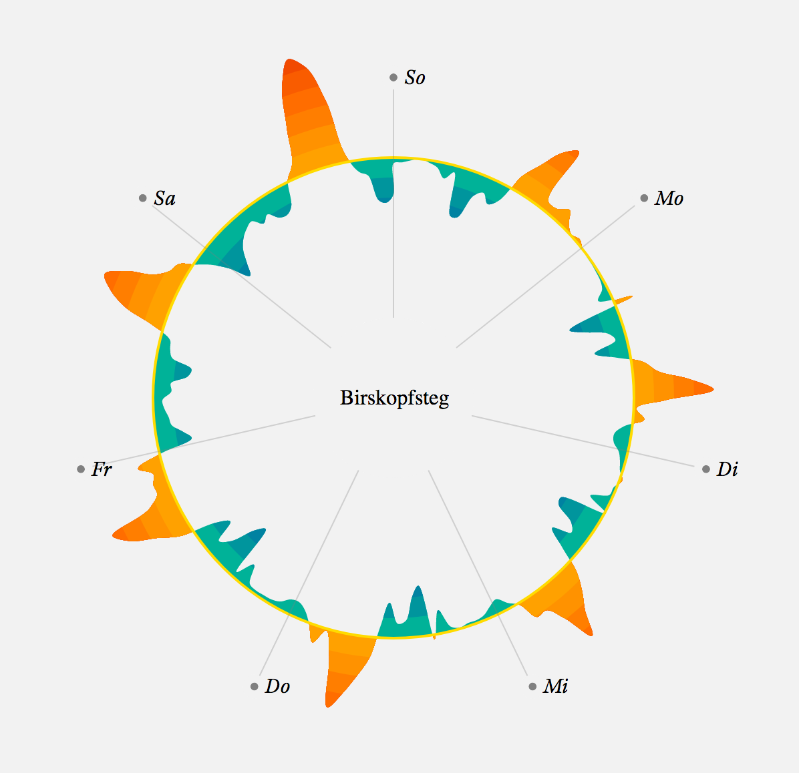
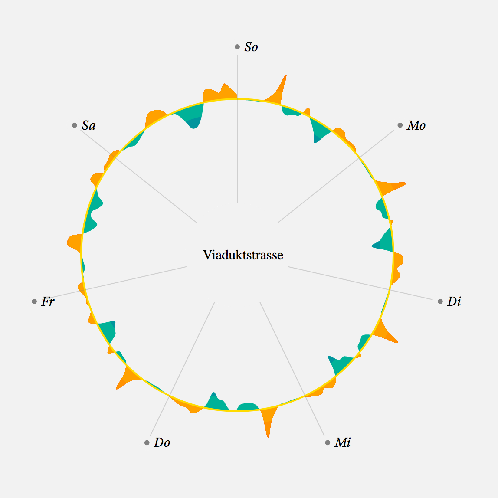

# Visualization of Variation in Cyclists

Done for the [TWIST Hackathon 2018](https://www.twist2018.ch/). In collaboration with a wonderful team:

* Monika Hebersen
* Dominik Meier
* Jacques Gengler
* Adrian Leuenberger
* Robert Dorbritz
* Jonas Oesch

The visualization design is a copy of the fantastic work by Nadieh Bremer and Zan Armstrong done for [Scientific American](https://blogs.scientificamerican.com/sa-visual/why-are-so-many-babies-born-around-8-00-a-m/?WT.mc_id=SA_FB_BIO_BLOG_INFO)

## Preview of the visualization





## Installation

1. Clone the repository:

```
git clone https://github.com/jonasoesch/cyclists-visualization
```

2. Change into the folder:

```
cd cyclists-visualization
```

3. Install the required node modules:

```
npm install
```

4. Run the Typescript server to preview

```
npm run start
```

5. And build into `dist`

```
npm run build
```
